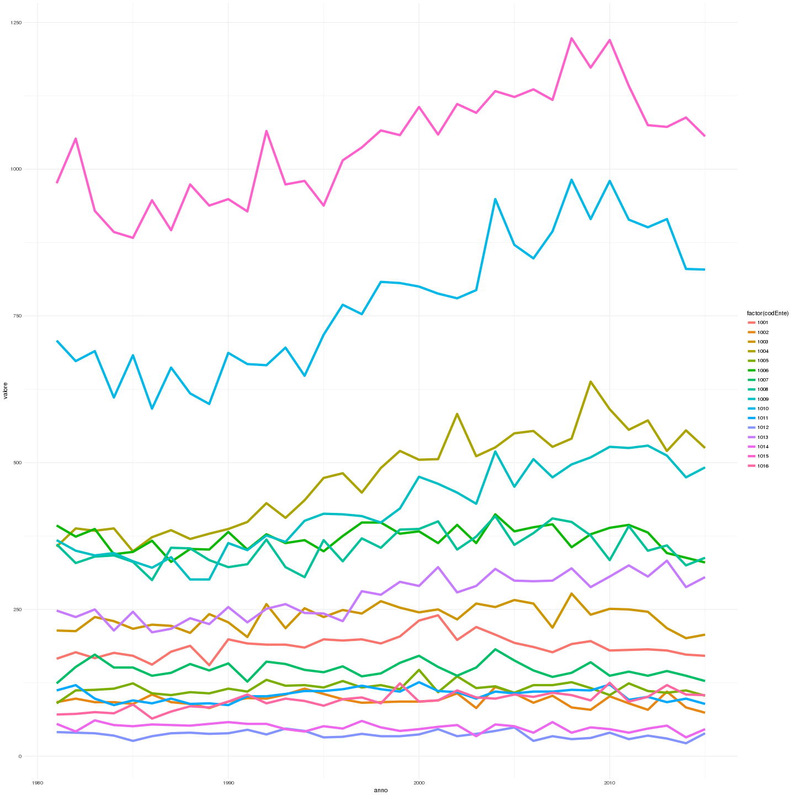

RUTrento Open Data pacakge
========================================================


***


Trentino Open Data Portal
========================================================

Portale Open Data della provincia di Trento  


<https://dati.trentino.it>

- 5287 dataset
- 214 organizzazioni
- Basato su CKAN (<https://ckan.org/>)

***


========================================================

### About CKAN

CKAN is a tool for making open data websites. (Think of a content management system like WordPress – but for data, instead of pages and blog posts.) 

It helps you manage and publish collections of data. It is used by national and local governments, research institutions, and other organizations who collect a lot of data.


RUTrentoOpenData
========================================================

- Acesso programmatico a portale _dati.trentino.it_
- Basato sul pacchetto _ckanr_
- Menù interattivo


- Disponibile su github
- Non ancora distribuito su CRAN


```r
library(devtools)

install_github('Trento-R-User-Group/RUTrentoOpenData')

library('RUTrentoOpenData')
```

RUTrentoOpenData
========================================================

La funzione principale è:
__ask_tod(query)__


```r
library('RUTrentoOpenData')

ask_tod('sensori')
The query returned these datasets, which one do you want to load? 

 1: Anagrafica Sensori Ufficio Dighe
 2: Rilevamento Sensori Idrometrici - Livello
 3: Rilevamento Sensori Idrometrici - Portata (Calcolata)
 4: Dati in tempo reale della stazione di Campodenno
 5: Anagrafica delle Stazioni di rilevamento di Campodenno
 6: Report mensile dei dati della stazione di Campodenno
 7: Riassunto rilievo traffico automatico (stazioni fisse) anno 2014
 8: Riassunto rilievo traffico automatico (stazioni fisse) anno 2013
 9: Riassunto rilievo traffico automatico (stazioni fisse) anno 2006
10: Riassunto rilievo traffico automatico (stazioni fisse) anno 2007
11: Riassunto rilievo traffico automatico (stazioni fisse) anno 2012
12: Riassunto rilievo traffico automatico (stazioni fisse) anno 2011
13: Riassunto rilievo traffico automatico (stazioni fisse) anno 2010
14: Riassunto rilievo traffico automatico (stazioni fisse) anno 2009
15: Riassunto rilievo traffico automatico (stazioni fisse) anno 2008
16: Riassunto rilievo traffico automatico (stazioni fisse) anno 2005
17: Riassunto rilievo traffico automatico (stazioni fisse) anno 2015
```


RUTrentoOpenData
========================================================

Alcune risorse selezionate nel primo passo sono composte da multipli file.

Il pacchetto cerca di scaricare la risorsa più rilevante (ina base a criteri definiti a priori basati sull'organizzazione produttrice)

__Il pacchetto non annulla la necessità di conoscere i _dataset_ presenti sul portale, ma fornisce uno strumento per lo scaricamento automatico__

Posso anche specificare la risorsa e il file specifico, se già li conosco


```r
ask_tod('sensori', pack_sel = 6)
These are the available resources,
                    which one do you want? 

1: Report Mensile XML
2: Report Mensile JSON
3: Campodenno Dashboard
```


```r
ask_tod('sensori', pack_sel = 6, res_sel = 2)
```


RUTrentoOpenData
========================================================

Una volta individuato il file, il pacchetto scarica il file e lo interpreta secondo il formato specifico.


```r
stazioniRilievo <- ask_tod('sensori', pack_sel = 7, res_sel = 1, sep = ',')
head(stazioniRilievo)
  Codice.Punto strada    km    localita               Data Totale Motocicli Autovetture.e.monovolumi
1          101   SP 1 2+300 Calceranica 01/01/2014 0:00:00   0.00      0.00                     0.00
2          101   SP 1 2+300 Calceranica 02/01/2014 0:00:00   0.00      0.00                     0.00
3          101   SP 1 2+300 Calceranica 03/01/2014 0:00:00   0.00      0.00                     0.00
4          101   SP 1 2+300 Calceranica 04/01/2014 0:00:00   0.00      0.00                     0.00
5          101   SP 1 2+300 Calceranica 05/01/2014 0:00:00   0.00      0.00                     0.00
6          101   SP 1 2+300 Calceranica 06/01/2014 0:00:00   0.00      0.00                     0.00
  Autovetture.e.monovolumi.con.rimorchio Furgoni Autocarro.medio..fino.a.8_7.m. Autocarro.grande..da.8_7.m.
1                                   0.00    0.00                           0.00                        0.00
2                                   0.00    0.00                           0.00                        0.00
3                                   0.00    0.00                           0.00                        0.00
4                                   0.00    0.00                           0.00                        0.00
5                                   0.00    0.00                           0.00                        0.00
6                                   0.00    0.00                           0.00                        0.00
  Autocarro.con.rimorchio Trattore.con.semirimorchio Autobus
1                    0.00                       0.00    0.00
2                    0.00                       0.00    0.00
3                    0.00                       0.00    0.00
4                    0.00                       0.00    0.00
5                    0.00                       0.00    0.00
6                    0.00                       0.00    0.00
```


RUTrentoOpenData
========================================================


```r
library(RUTrentoOpenData)
library(dplyr)
library(ggplot2)

nati <- ask_tod('nati', pack_sel = 1)

filter(nati, codEnte > 300, codEnte< 2000) %>% 
  ggplot() +
  geom_line(aes(x = anno, y = valore, group = codEnte, color = factor(codEnte)), size = 2) +
  theme_minimal()
```




RUTrentoOpenData
========================================================

# TODO:

- Aumentare organizzazioni/dataset con risorsa di default
- Aumentare i formati riconosciuti
- Tests!

# HELP US!

Github: <https://github.com/Trento-R-User-Group/RUTrentoOpenData>

